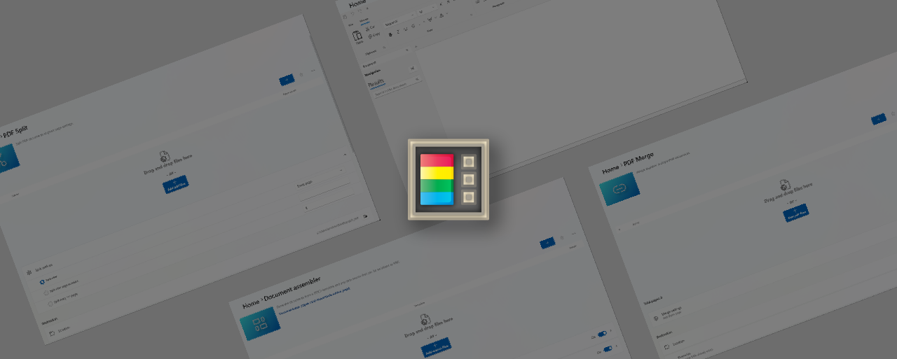

# DocToys

[How to use DocToys][usingDocToys-docs-link] | [Downloads & Release notes][github-release-link] | [What's Happening](#whats-happening) | [Roadmap](#doctoys-roadmap)

## About

DocToys is a set of utilities for generating rich text documents, manage PDF files and many more.

|              | Current utilities: |              |
|--------------|--------------------|--------------|
| [Text Editor](https://github.com/rabazco/DocToys/wiki/TextEditor-Overview) | [DocMaker](https://github.com/rabazco/DocToys/wiki/DocMaker-Overview) | [PDF Merge](https://github.com/rabazco/DocToys/wiki/PDFMerge-Overview) |
| [PDF Split](https://github.com/rabazco/DocToys/wiki/PDFSplit-Overview)|

## Installing and running DocToys

### Requirements

- Windows 11 or Windows 10 version 2004 (code name 20H1 / build number 19041) or newer.
- x64 or ARM64 processor

### Via Microsoft Store

Install from the [Microsoft Store's DocToys page][microsoft-store-link]. You must be using the [new Microsoft Store](https://blogs.windows.com/windowsExperience/2021/06/24/building-a-new-open-microsoft-store-on-windows-11/) which is available for both Windows 11 and Windows 10.

## What's Happening

### DocToys Roadmap

Our [prioritized roadmap][roadmap] of features and utilities that the core team is focusing on.

### 0.1.0.0 - August 2025 Initial release

In this release, we focused on new features, stability, and improvements.

✨**Highlights**
 
 - Multi Tab Text Editor with autosave. Continue your work where you left.
 - DocMaker. Generate documents from a DOCX template and any data source that can be serialized as XML. Our intelligent DocMaker merges official XML tax forms (e.g. Modelo 650) into legally structured Word templates in seconds. Ideal for inheritance declarations and other complex filings, this tool transforms tax data into polished private documents – instantly.
 - Merge multiple PDF documents.
 - Split PDF documents at given pages.

#### What is being planned for version 0.2.0.0

For [v0.2.0.0][github-next-release-work], we'll work on the items below:

 - Stability / bug fixes
 - DocMaker Template Market

## Privacy Statement

The application logs basic diagnostic data (telemetry). For more information on privacy and what we collect, see our [DocToys Data and Privacy documentation](https://github.com/rabazco/DocToys/blob/main/DATA_AND_PRIVACY.md).

[github-release-link]: https://github.com/rabazco/DocToys/releases
[microsoft-store-link]: https://apps.microsoft.com/detail/9PKRL773JTFL
[roadmap]: https://github.com/rabazco/DocToys/wiki/Roadmap
[privacy-link]: https://github.com/rabazco/DocToys/blob/main/DATA_AND_PRIVACY.md
[loc-bug]: https://github.com/rabazco/DocToys/issues/new?assignees=&labels=&template=translation_issue.md&title=
[usingDocToys-docs-link]: https://github.com/rabazco/DocToys/wiki/Home
[github-next-release-work]: https://github.com/rabazco/DocToys/issues?q=is%3Aissue+milestone%3A%22DocToys+0.2.0.0%22

